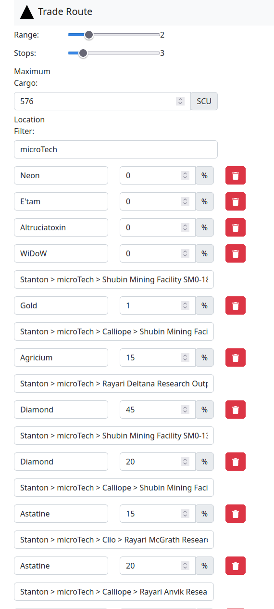
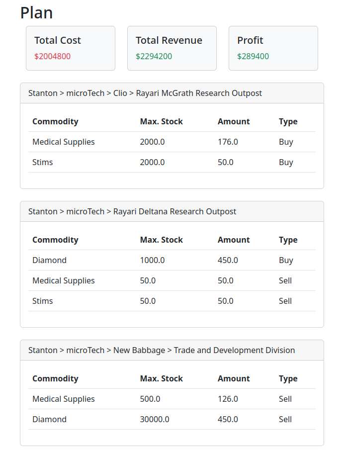
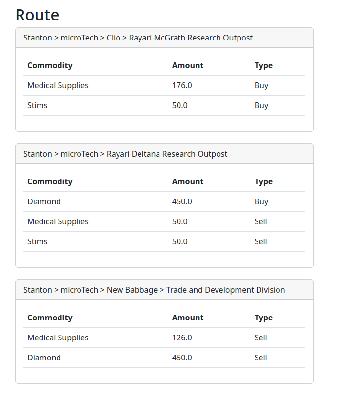

# SC-MIP

## Introduction
Many simulation games incorporate a trading element where players engage in the buying and selling of goods. Typically, players visit various producers that offer a specific set of goods at a low price and subsequently deliver these goods to different consumers willing to purchase them at a higher price. The natural objective in such scenarios is to maximize profit following a successful trading endeavor. This analysis focuses on Star Citizen, a space simulation game currently in development.

In Star Citizen, each outpost on planets/moons and space stations maintains a list of goods available for sale and purchase. For example, a mining outpost may sell various minerals while seeking to buy items like medical supplies. Frequently, the producing locations offer goods at a lower price, making a trading strategy viable. The strategic approach involves acquiring goods from these producing locations and selling them in major hubs such as space stations or cities. The ultimate goal is to determine the optimal producers and consumers to visit, along with the ideal quantities to purchase and sell.

## Motivation
Presently, there are available tools designed for identifying trade routes. However, these tools appear to face limitations in identifying routes that span across multiple locations while accommodating various types of cargo. Moreover, considering the current state of supply in the game, these existing tools seem incapable of factoring in the anticipated low supply of highly profitable goods. Therefore, by explicitly formulating the problem in the language of optimization, it is possible to address some of these issues.

## UX

A sample web-application that generates interesting routes carrying multiple types of commodities is provided.

### Customize Requirements

### High Level Plan

### Specific Route

## Deployment

The sample web application can be built and deployed using Docker. See [Dockerfile](Dockerfile).

## Implementation

The formulation of the optimization problem is explained in this [notebook](SC%20Trade%20Optimization.ipynb). The 
application of the formulation from the notebook can be found in [optimize.py](optimize.py)
